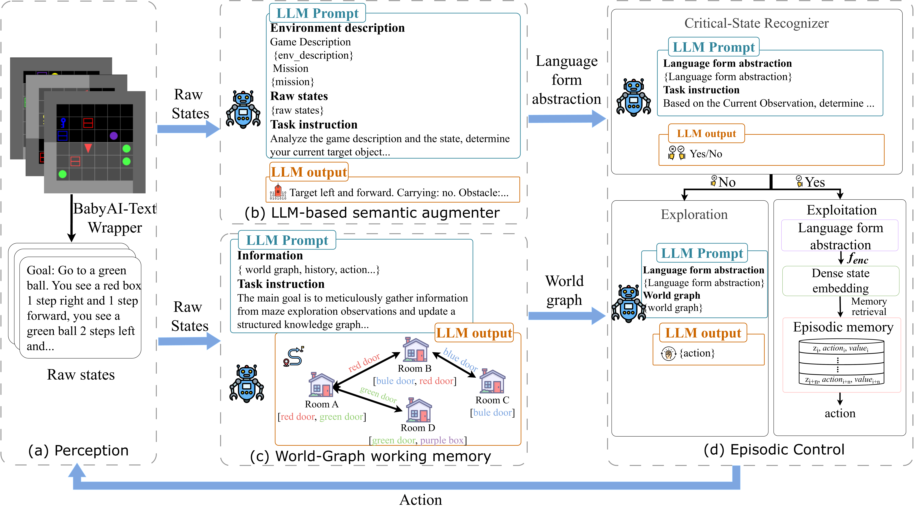

# Agentic Episodic Control (AEC)

This is the official repository for the paper **"Agentic Episodic Control"**.

Reinforcement learning suffers from poor data efficiency and weak generalization. Prior episodic RL methods attempt to address this via external memory but face two fundamental limitations: a **representation bottleneck** caused by shallow encoders that produce narrow, task-specific embeddings, and a **retrieval dilemma** where episodic memory is accessed indiscriminately at every timestep.

**Agentic Episodic Control (AEC)** resolves both issues by integrating large language models into episodic RL through two key modules:

- **LLM-based Semantic Augmenter** — maps raw observations to language-grounded abstractions that expose latent, task-relevant structure, enabling semantically meaningful memory indexing.
- **Critical-State Recognizer** — selectively triggers episodic recall only at decision-critical moments, transforming memory access from passive similarity matching into strategic, context-aware recall.

Across five BabyAI-Text environments, AEC achieves **2–6× higher data efficiency** than baselines and is the **only method to solve complex tasks like UnlockLocal with over 90% success**. It further demonstrates strong cross-task and cross-environment generalization, maintaining performance even under distribution shifts.

## Overview

<p align="center">
  
</p>

Raw states are processed in parallel by an LLM-based semantic augmenter **(b)** to produce language-form abstractions and by a World-Graph working memory module **(c)** to build a structured working memory of entities and relations. An episodic control module **(d)**, equipped with a critical-state recognizer, then uses these representations to decide whether to exploit episodic memory or to continue exploring under World-Graph guidance.

The supported workflow centers on:

- `experiments/train_agent.py` for training
- `experiments/test_agent.py` for evaluation
- `experiments/agents/aec/` for the agent implementation

## Features

- AEC agent implementation enhanced with LLM reasoning
- BabyAI text-based environment support
- Training and evaluation entrypoints with shared runtime helpers
- WandB integration for experiment tracking
- Repository-relative defaults

## Project Structure

```text
.
├── experiments/
│   ├── agents/
│   │   ├── base_agent.py
│   │   └── aec/
│   ├── arguments.py
│   ├── runtime.py
│   ├── train_agent.py
│   ├── test_agent.py
│   ├── train_agent.sh
│   └── test_agent.sh
├── babyai-text/
├── LLM_models/
├── models/
├── storage/
├── requirements.txt
└── README.md
```

## Installation

1. Install Python dependencies:

```bash
pip install -r requirements.txt
```

2. Install BabyAI text environment dependencies:

```bash
cd babyai-text/babyai
pip install -e .
cd ../gym-minigrid
pip install -e .
cd ..
pip install -e .
```

3. Download the sentence embedding model weights:

```bash
cd experiments/agents/aec/SentenceEmbeddingsModels/bert-sentence-transformers
# Download from HuggingFace: sentence-transformers/all-MiniLM-L6-v2
# Place pytorch_model.bin and model.safetensors in this directory
```

4. Set up the LLM model (e.g., Qwen2.5-32B-Instruct) under `LLM_models/` or specify a custom path via `--llm_name`.

## Configuration

Default paths are resolved relative to the repository.

If you need API-based LLM access, configure credentials through environment variables:

```bash
export AEC_API_KEY=your_api_key
export AEC_API_BASE_URL=your_base_url
```

Compatible fallbacks:

- `OPENAI_API_KEY`
- `OPENAI_BASE_URL`

## Usage

### Train

```bash
bash experiments/train_agent.sh
```

Or run directly:

```bash
python experiments/train_agent.py --agent_type aec --num_frames 70000
```

### Test

```bash
bash experiments/test_agent.sh
```

Or run directly:

```bash
python experiments/test_agent.py --agent_type aec --test_env_num 100
```

## Acknowledgements

This project builds upon:

- BabyAI platform for instruction following and language grounding
- Neural Episodic Control algorithm
- LLM tooling used for text understanding and generation
